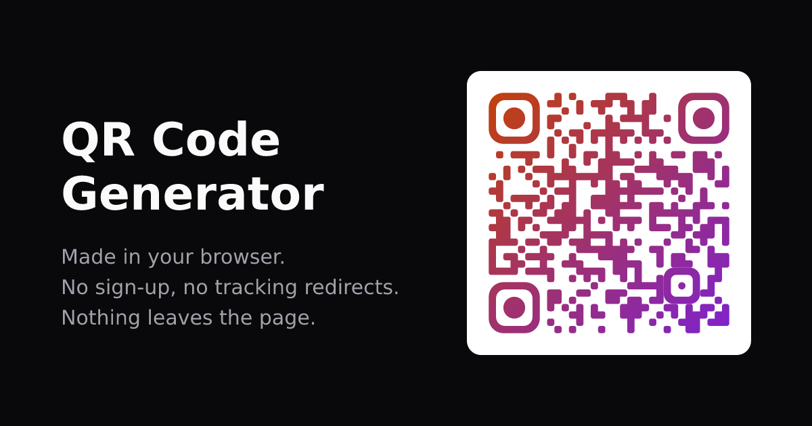

# QR Code Generator

A QR code generator that never sends what you type anywhere. Styled modules
and eyes, colours and gradients, logos, presets, PNG/SVG export with sensible
file names, and a built-in scan check. Everything runs in your browser.



**Try it:** https://ryanmr.github.io/qr-code-generator/

## Why

Search for [“qr code generator”](https://www.google.com/search?q=qr+code+generator)
and most top results are sign-up funnels. Many encode their own short link
instead of yours, so they can count scans, and the code stops working when the
trial ends. This one encodes exactly what you type, and the page cannot phone
home even if it wanted to.

## Made by robots

Every line of code and documentation in this repository was written by AI
(Claude, using [Claude Code](https://claude.com/claude-code)). A human directed
it and tested it. Read it with that in mind; the round-trip tests below are the
main reason to trust the output.

## Privacy model

- **Everything happens in the browser.** The server serves static files and
  `/api/health`, nothing else. There is no endpoint that takes QR content.
- **The browser enforces it.** The page has a CSP with `connect-src 'none'`,
  so it cannot make any network request at all. The server sends it as a
  header (`server/src/headers.ts`) and the build also writes it into
  `index.html` as a `<meta>` tag, so static hosts enforce it too.
- **No third-party assets.** No CDNs, web fonts, analytics or tracking codes;
  Vite bundles everything.
- **Every code has a URL.** The address bar is kept in sync with readable
  query parameters (`web/src/lib/query.ts`), so it can be copied or
  bookmarked. That means content, Wi-Fi passwords included, ends up in browser
  history, and opening such a link sends it to whoever hosts the page. The
  bundled server logs paths only (Hono's built-in logger would log the query).
  Logos are never included.
- **Storage:** style and saved presets in `localStorage`; content only if
  "Remember content" is on; logos in memory only.

## Hosting your own

### Container (preferred)

The Docker image runs a small [Hono](https://hono.dev) server that serves the
built React + TanStack Router SPA. It is the preferred way to host because it
sends the CSP as a real header (including `frame-ancestors`, which a `<meta>`
tag cannot set), logs paths but never query strings, and falls back to
`index.html` for client-side routes.

```sh
docker build -t qr-code-generator .
docker run -d --name qr -p 8640:8640 --read-only qr-code-generator
```

It is stateless, runs as `node`, and works with a read-only filesystem. Pass
`--build-arg SITE_URL=https://qr.example.com` to get absolute links in social
previews. `docker-compose.yml` is the author's own deployment behind Traefik;
change the labels or drop them. If your reverse proxy keeps access logs, strip
the query string for this site, because that is where content lives.

### Static (GitHub Pages or any static host)

```sh
BASE_PATH=/ SITE_URL=https://qr.example.com npm run build:static --workspace=web
# upload web/dist/
```

`build:static` adds `404.html` and `about/index.html` so deep links load
without a server. Trade-offs against the container: no `frame-ancestors`, the
host's access logs may record full URLs, and on a shared origin such as
`<user>.github.io` other pages on that origin can read `localStorage`.

To publish a fork on GitHub Pages, set **Settings → Pages → Source** to
**GitHub Actions**. `.github/workflows/pages.yml` tests, builds with the right
base path and deploys on every push to `main`. It skips private repos.

## How it works

| Piece | File |
|---|---|
| Encoder | `web/src/lib/qr/qrcodegen.ts`: [Nayuki's library](https://github.com/nayuki/QR-Code-generator), vendored (MIT), pinned commit in the header |
| Wrapper | `web/src/lib/qr/encode.ts`: ECC, boost, min version, mask; reports version and fill |
| Renderer | `web/src/lib/qr/render-svg.ts` + `shapes.ts`: the one renderer; preview, SVG and PNG all come from it |
| PNG | `web/src/lib/qr/rasterize.ts`: SVG → canvas → blob |
| Scan check | `web/src/lib/qr/scan-check.ts`: decodes the rendered code with jsQR in the tab |
| Payloads | `web/src/lib/payload.ts`: URL, text, Wi-Fi, email, phone, SMS, vCard, geo |
| File names | `web/src/lib/filename.ts`: `qr-code-<subject>-<yyyy-mm-dd>[-<size>px].<ext>` |

Module shapes are neighbour-aware: a corner is only rounded where both sides
meeting at it are exposed, so runs fuse into blobs and bars. Finder **and
alignment** patterns are drawn as whole shapes in the eye style; leaving the
alignment pattern to the module shape made dot and diamond codes undecodable
from version 2 up.

## URL parameters

| Key | Meaning |
|---|---|
| `type` | `url` (default), `text`, `wifi`, `email`, `phone`, `sms`, `contact`, `location`. Inferred from the fields present if omitted |
| content fields | Same names as the form: `url`, `text`, `ssid`/`password`/`security`/`hidden`, `to`/`subject`/`body`, `number`/`message`, `name`/`phone`/`email`/`org`/`url`, `lat`/`lng` |
| `shape` | `square`, `rounded`, `extra-rounded`, `dots`, `classy`, `vertical`, `horizontal`, `diamond`, `star` |
| `frame`, `ball` | Eye frame / centre: `square`, `rounded`, `circle`, `leaf` |
| `fg`, `fg2`, `bg`, `eye` | Hex colours without `#`; `eye=none` follows the foreground |
| `gradient`, `angle` | `none`/`linear`/`radial`, degrees |
| `transparent`, `boost` | `1`/`0` |
| `margin`, `radius`, `size` | Modules 0–8, percent 0–100, pixels 64–8192 |
| `ecc`, `version`, `mask` | `L`/`M`/`Q`/`H`, 1–40, -1–7 |

`?url=example.com` just seeds the input and keeps your saved style; extra style
keys adjust it. A URL with `shape` (which the synced address bar always has)
describes the whole style, so missing keys mean the default. Old `#q=` share links still load.

## Development

Needs Node 24.

```sh
npm install
npm run dev        # Hono on :8640, Vite on :5175
npm test           # vitest: payloads, file names, and render→rasterise→decode
                   # round-trips for every module × eye shape and preset
npm run typecheck
npm run build      # container build: web/dist + server/dist
npm run icons --workspace=web   # regenerate PNG icons and the social card
```

The round-trip tests use `@resvg/resvg-js` to rasterise and `jsqr` to decode.
If a new shape or preset fails them, it will fail on phones too.

## Contributing

Pull requests are welcome within reason: bug fixes, new shapes or presets that
pass the round-trip tests, accessibility. Changes that add network access,
accounts, analytics or third-party assets will not be merged; fork it instead,
that is what the licence is for. `CLAUDE.md` lists the invariants.

## Credits

- [QR Code generator library](https://github.com/nayuki/QR-Code-generator) by
  Project Nayuki (MIT), vendored in `web/src/lib/qr/qrcodegen.ts`.
- [jsQR](https://github.com/cozmo/jsQR) (Apache 2.0) for the scan check.
- React, TanStack Router, Base UI, Tailwind CSS, Lucide icons, Hono and Vite.

## Licence

[MIT](LICENSE).
